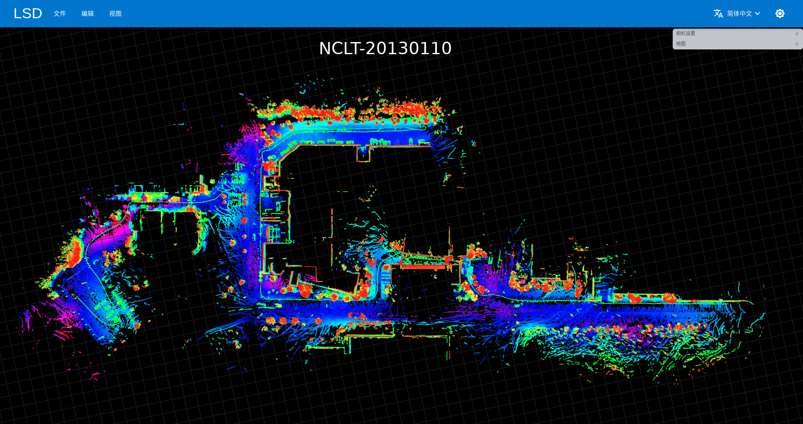
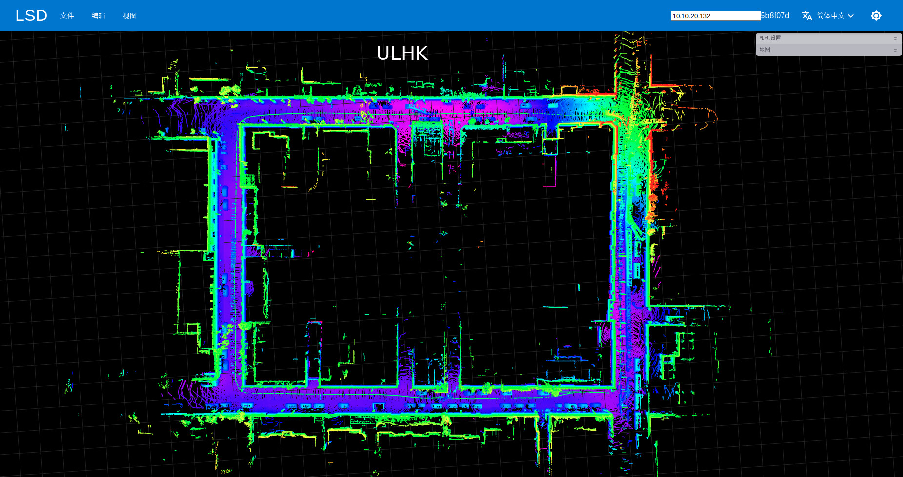
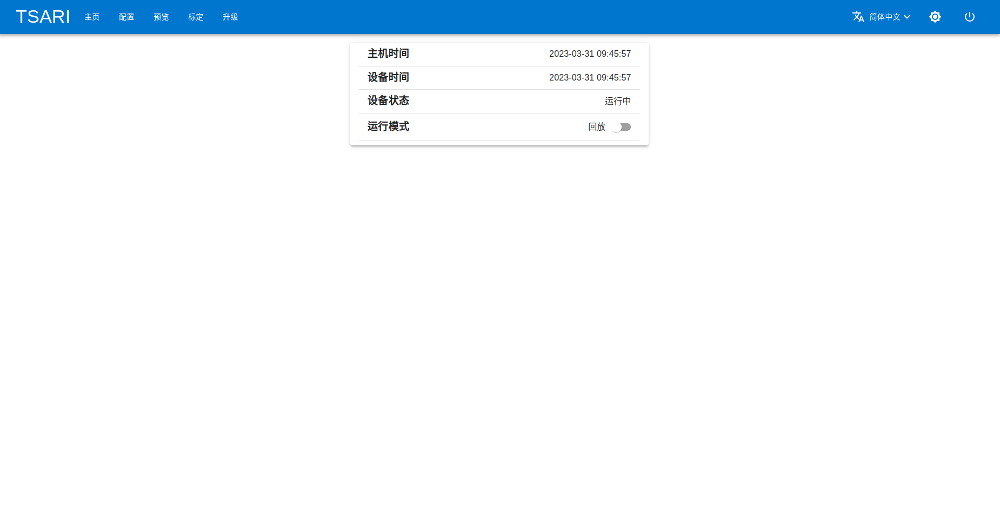

# LSD (LiDAR SLAM & Detection)

LSD is an open source perception architecture for autonomous vehicle and robotics.

<div align="left">




LSD currently supports many features:

- [x] support multiple LiDAR, camera, radar and INS/IMU sensors.
- [x] support user-friendly calibration for LiDAR and camera etc.
- [x] support software time sync, data record and playback.
- [x] support voxel 3D-CNN based pointcloud object detection, tracking and prediction.
- [x] support FastLIO based frontend odometry and G2O based pose graph optimization.
- [x] support Web based interactive map correction tool(editor).
- [x] support communication with [ROS](#ros).

# Overview

- [Quick Demo](docs/demo/README.md)
- [Architecture](docs/architecture.md)
- [Mapping & Localization](docs/slam.md)
- [Object Detection & Tracking](docs/detect.md)

# Changelog

**[2024-12-21]** LiDAR mapping (LIO odometry and PGO) is further improved.
- LIO odometry: degenerate detection and wheelspeed observation for FASTLIO.
- PGO backend: GNSS outlier detection and extrinsic estimation.
- Map management: support automatic multi-maps merging.
- Other: pointcloud colouration with multi-cam, dense map generation and pointcloud to BEV (under tools/postprocessing).
- BUG fix: UTM projection when cross the projection zone and the grid converage of UTM is considered.

**[2023-10-08]** Better 3DMOT (GIOU, Two-stage association).
| Performance (WOD val) | AMOTA ↑ | AMOTP ↓ |  IDs(%) ↓ |
|-----------------------|:-------:|:-------:|:---------:|
| AB3DMOT               |  47.84  |  0.2584 |   0.67    |
| GIOU + Two-stage      |  54.79  |  0.2492 |   0.19    |

**[2023-07-06]** A new detection model (CenterPoint-VoxelNet) is support to run realtime (30FPS+).
| Performance (WOD val) | Vec_L1 | Vec_L2 | Ped_L1 | Ped_L2 | Cyc_L1 | Cyc_L2 |
|--------------------------|:----------:|:-------:|:-------:|:-------:|:-------:|:-------:|
| PointPillar              | 73.71/73.12|65.71/65.17|71.70/60.90|63.52/53.78|65.30/63.77 |63.12/61.64|
| CenterPoint-VoxelNet (1 frame)     | 74.75/74.24|66.09/65.63|77.66/71.54|68.57/63.02|72.03/70.93 |69.63/68.57|
| **CenterPoint-VoxelNet** (4 frame) | **77.55/77.03**|**69.65/69.17**|**80.72/77.80**|**72.91/70.15**|**72.63/71.72** |**70.55/69.67**|

**Note: the CenterPoint-VoxelNet is built on [libspconv](https://github.com/NVIDIA-AI-IOT/Lidar_AI_Solution) and the GPU with SM80+ is required.**

**[2023-06-01]** [Web UI](web_ui/README.md)(JS code of preview, tviz and map editor) is uploaded.

### Basic Enviroment

Ubuntu20.04, Python3.8, Eigen 3.3.7, Ceres 1.14.0, Protobuf 3.8.0, NLOPT 2.4.2, G2O, OpenCV 4.5.5, PCL 1.9.1, GTSAM 4.0

# Getting Started

NVIDIA Container Toolkit is needed to install firstly [Installation](https://docs.nvidia.com/datacenter/cloud-native/container-toolkit/latest/install-guide.html).

A x86_64 docker image is provided to test.
```bash
sudo docker pull 15liangwang/lsd-cuda118 # sudo docker pull 15liangwang/lsd-cpu, if you don't have GPU
sudo docker run --gpus all -it -d --net=host --privileged --shm-size=4g --name="LSD" -v /media:/root/exchange 15liangwang/lsd-cuda118
sudo docker exec -it LSD /bin/bash
```

Clone this repository and build the source code
```bash
cd /home/znqc/work/
git clone https://github.com/w111liang222/lidar-slam-detection.git
cd lidar-slam-detection/
unzip slam/data/ORBvoc.zip -d slam/data/
python setup.py install
bash sensor_inference/pytorch_model/export/generate_trt.sh
```

Run LSD
```bash
tools/scripts/start_system.sh
```
Open http://localhost (or http://localhost:1234) in your browser, e.g. Chrome, and you can see this screen.




## Example Data

Download the demo data [Google Drive](https://drive.google.com/file/d/1wi3KATudMX3b4Wz0Bu-qcScaFuQDvXwW/view?usp=sharing) | [百度网盘(密码sk5h)](https://pan.baidu.com/s/1N7-w-Ls294MzfvX2X866Uw) and unzip it. (other dataset can be found [百度网盘, 提取码：36ly](https://pan.baidu.com/s/1BYgwkSWehtnPCn4NUBg_cA?pwd=36ly))

```bash
unzip demo_data.zip -d /home/znqc/work/
tools/scripts/start_system.sh # re-run LSD
```

More usages can be found [here](docs/guide.md)

# ROS

LSD is NOT built on the Robot Operating System (ROS), but we provides some tools to bridge the communication with ROS.

- [rosbag to pickle](tools/rosbag_to_pkl/README.md): convert rosbag to pickle files, then LSD can read and run.
- [pickle to rosbag](tools/pkl_to_rosbag/README.md): a convenient tool to convert the pickle files which are recorded by LSD to rosbag.
- [rosbag proxy](tools/rosbag_proxy/README.md): a tool which send the ros topic data to LSD.

# License

LSD is released under the [Apache 2.0 license](LICENSE).

# Acknowledgments

In the development of LSD, we stand on the shoulders of the following repositories:

- [lidar_align](https://github.com/ethz-asl/lidar_align): A simple method for finding the extrinsic calibration between a 3D lidar and a 6-dof pose sensor.
- [lidar_imu_calib](https://github.com/chennuo0125-HIT/lidar_imu_calib): automatic calibration of 3D lidar and IMU extrinsics.
- [OpenPCDet](https://github.com/open-mmlab/OpenPCDet): OpenPCDet Toolbox for LiDAR-based 3D Object Detection.
- [AB3DMOT](https://github.com/xinshuoweng/AB3DMOT): 3D Multi-Object Tracking: A Baseline and New Evaluation Metrics.
- [FAST-LIO](https://github.com/hku-mars/FAST_LIO): A computationally efficient and robust LiDAR-inertial odometry package.
- [R3LIVE](https://github.com/hku-mars/r3live): A Robust, Real-time, RGB-colored, LiDAR-Inertial-Visual tightly-coupled state Estimation and mapping package.
- [FLOAM](https://github.com/wh200720041/floam): Fast and Optimized Lidar Odometry And Mapping for indoor/outdoor localization.
- [hdl_graph_slam](https://github.com/koide3/hdl_graph_slam): an open source ROS package for real-time 6DOF SLAM using a 3D LIDAR.
- [hdl_localization](https://github.com/koide3/hdl_localization): Real-time 3D localization using a (velodyne) 3D LIDAR.
- [ORB_SLAM2](https://github.com/raulmur/ORB_SLAM2): Real-Time SLAM for Monocular, Stereo and RGB-D Cameras, with Loop Detection and Relocalization Capabilities.
- [scancontext](https://github.com/irapkaist/scancontext): Global LiDAR descriptor for place recognition and long-term localization.

# Citation
If you find this project useful in your research, please consider cite and star this project:

```
@misc{LiDAR-SLAM-Detection,
    title={LiDAR SLAM & Detection: an open source perception architecture for autonomous vehicle and robotics},
    author={LiangWang},
    howpublished = {\url{https://github.com/w111liang222/lidar-slam-detection}},
    year={2023}
}
```

# Contact

LiangWang 15lwang@alumni.tongji.edu.cn
