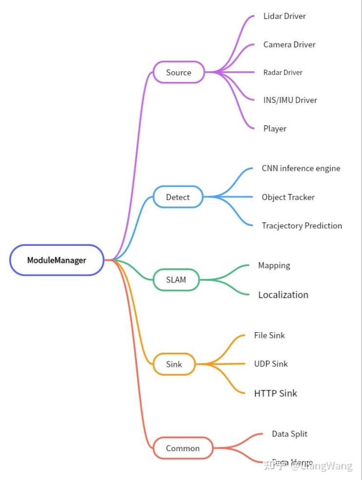
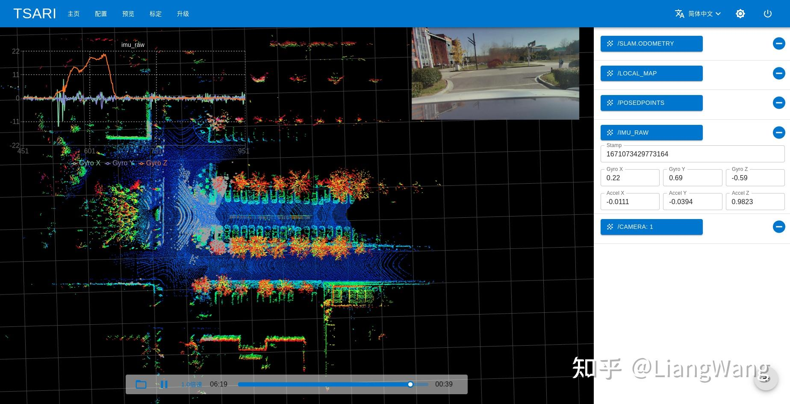

# 背景

自动驾驶/机器人环境感知区别于PNC （Planning and Control）模块，环境感知通常需要处理多个高线数激光雷达和相机传感器数据，其特点在于点云和图像的数据量非常大，比如一个128线激光雷达，每秒产生约20MB点云数据（x, y, z, intensity），一个1080P@30FPS相机，数据量可达到每秒约180MB。

在自动驾驶领域，ROS(Robot Operating System）是一个经常被研究者们用于开发实现各类算法的基础框架，我们知道，ROS1是一个分布式框架，每个模块之间都是一个个独立的进程，为了实现各模块之间的数据通讯，ROS1设计了一套完整的通讯机制（例如ros topic, ros service等），其底层协议则采用了TCP/UDP协议，当传输点云或图像数据时，ROS框架内部会存在大量的数据拷贝、分包转发等处理，从而可能导致出现消息延迟等问题。

因此，为了减轻上述问题以提高系统实时性，LSD在实现时并未采用ROS框架，而是将所有传感器数据由一个主进程（内部创建一些子进程）来统一管理，在结构上采用可配置数据管线（类似于gstreamer/ffmpeg等多媒体框架）和消息发布订阅机制来灵活实现数据交互。以下是与ROS的一些方面的对比：

|         | LSD                                            |  ROS1                                                          |
|:-------:|:---------------------------------------------  |:---------------------------------------------------------------|
| 编程语言 | Python3/C++(pybind11)                          | C++为主/python2.x                                              |
| 整体结构 | 传感器数据 -> 算法模块（检测、定位）-> 输出模块    | 分布式，每个模块一个进程（由roscore分发数据）                     |
| 数据交互 | 同一进程直接访问（无拷贝），子进程（pickle序列化） | 序列化为类C结构字符串，XMLRPC，走TCP/IP协议栈（数据需要拷贝和分包） |
| 消息机制 | 采用ZeroCM第三方库实现，用于少量的消息发布和订阅   | ROS Topic                                                      |
| 远程调用 | 采用ZeroRPC实现，主要用于Web可视化               | ROS Service                                                     |
| 可视化   | 基于Web开发的预览页面和TViz                     | RViz                                                            |

由于LSD整体由Python3和C++实现，不基于ROS系统，因此具备较好的可移植性，能够运行在各种存储容量较小的嵌入式设备上。下面将详细介绍“可配置数据管线”和“消息发布订阅”机制。

# 可配置数据管线

该框架主要用于点云、图像等数据量较大的传感器数据处理，在使用方式上，可以通过配置文件来灵活实现各个模块之间的数据交互。

在LSD内部实现了以下几个基础模块：Source，Detect， SLAM， Sink和Common，由ModuleManager统一管理。层次结构如下图所示：



- Source管理各个传感器输入数据解析、同步等。
- Detect / SLAM作为中间模块处理传感器数据并输出目标检测结果和建图定位结果。
- Sink接收上游数据并通过UDP/HTTP协议输出或写入磁盘。
- Common用于数据分割和合并操作。

LSD可以通过配置文件来控制上述各个模块的连接关系，从而实现多种工作模式。例如：数据采集模式的数据管线为：Source -> Sink。而目标检测模式则配置成：Source -> Detect -> Sink。可配置数据管线框架的具体实现代码位于**lidar-slam-detection/module**目录下。

# 消息发布订阅机制

LSD主要以可配置Pipeline的结构运行，在此基础上，增加部分消息发布订阅机制来提高框架的灵活性。LSD基于[ZeroCM](https://github.com/ZeroCM/zcm)第三方库实现了基础的消息发布订阅功能。

ZeroCM发源于LCM项目，主要区别在于增加了UDP Multicast/IPC等底层通讯协议。LSD基于ZeroCM的Type System定义了多个与ROS中相似的消息类型：

## 基本消息

std_msgs::Byte，std_msgs::String，std_msgs::Int32，std_msgs::Int64，std_msgs::Float

## Geometry消息

geometry_msgs::Point32，geometry_msgs::Quaternion，geometry_msgs::Vector3，geometry_msgs::Point，geometry_msgs::Pose，geometry_msgs::PoseStamped，geometry_msgs::Twist，geometry_msgs::PoseWithCovariance，geometry_msgs::TwistWithCovariance

## Nav消息

nav_msgs::Odometry，nav_msgs::Path

## Sensor消息

sensor_msgs::PointField，sensor_msgs::Image，sensor_msgs::CompressedImage，sensor_msgs::Imu，sensor_msgs::NavSatStatus，sensor_msgs::NavSatFix，sensor_msgs::PointCloud

以下是sensor_msgs::Imu的定义：
```
package sensor_msgs;
struct Imu
{
    .std_msgs.Header header;
    .geometry_msgs.Quaternion orientation;
    .geometry_msgs.Vector3 angular_velocity;
    .geometry_msgs.Vector3 linear_acceleration;
}
```

可以发现与ROS中定义的基本一致，方便熟悉ROS的开发人员可以快速上手。上述所有消息的定义和源码位于**lidar-slam-detection/sensor_driver/common_lib/logging/message**目录下。

## 发布订阅

LSD提供了一些宏定义函数来帮助开发者快速实现数据发布，例如只需通过下面几行代码就可以发布Imu消息：

```
sensor_msgs::Imu imu_msg;
imu_msg.header.stamp = timestamp;
imu_msg.angular_velocity.x = gyro_x;
imu_msg.angular_velocity.y = gyro_y;
imu_msg.angular_velocity.z = gyro_z;
imu_msg.linear_acceleration.x = acc_x;
imu_msg.linear_acceleration.y = acc_y;
imu_msg.linear_acceleration.z = acc_z;
PUBLISH_MSG("imu_raw", imu_msg);
```

消息的订阅则可以通过回调函数来实现：
```
class Handler {
  public:
    ~Handler() {}
    void handleMessage(const zcm::ReceiveBuffer* rbuf, const string& chan, const example_t *msg) {
        // process message
    }
};

Handler handler;
std::shared_ptr<zcm::ZCM> core = create_core();
core->subscribe(CHANNEL, &Handler::handleMessage, &handler);
core->start();
```

## 常用消息格式转换

LSD提供了一些基础转换函数，可以轻松地将PCL PointCloud与sensor_msgs::PointCloud互相转换、OpenCV的cv::Mat和sensor_msgs::Image相互转换等。

# TViz

TViz是LSD包含的一个基于Web实现的3D可视化工具（类比与RViz），可以用于实现点云/图像/轨迹等各种消息的订阅和显示。使用方式简单：

在启动LSD之后，只需要打开浏览器访问http://localhost/tviz (若本机80端口占用，则访问http://localhost:1234/tviz) 即可使用Tviz：



相比于RViz, TViz集成了曲线图显示功能，通过右键选中的message弹出对话框，选择需要绘制曲线的x轴和y轴数据即可。
