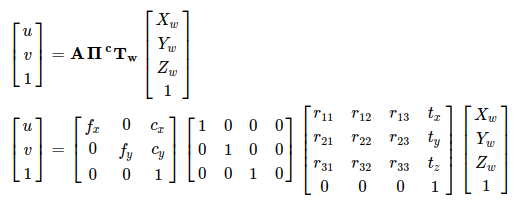

# 点云地图着色

点云地图着色是通过相机获取图像，对点云进行渲染，从而得到包含RGB属性的地图，能够用于地图元素标注、三维重建等。

点云地图着色算法流程可以分解为两个步骤：1.点云地图构建，2.利用图像对点云地图渲染。具有类似功能的开源算法有R3LIVE(一种激光视觉IMU紧耦合里程计)，R3LIVE通过LIO构建点云地图，联合VIO算法完成位姿修正和渲染并输出RGB点云地图，但是R3LIVE构建具有回环或者范围较大的地图时，由于LIO里程计存在累计误差，会出现地图重影等问题。

LSD采用点云定位与地图渲染相结合的方式，借助定位算法无累计误差的特性，因此能够实现大范围、无重影的地图着色功能，大概的算法流程如下:
1. 利用激光里程计联合后端优化和地图编辑构建全局一致点云地图
2. 基于离线构建地图，进行实时点云定位，将当前激光点云及其全局姿态输入给渲染模块
3. 由于激光定位和相机外参存在一定的误差，渲染模块首先进行图像特征点跟踪，并利用ESIKF滤波优化重投影和光度误差来得到更准确的相机姿态，最后将全局点云投影到图像坐标，通过贝叶斯概率公式计算地图点云的RGB值

点云渲染算法主要基于R3LIVE的VIO实现，在其基础上进行了优化: 解耦LIO部分、移除IMU依赖、优化内存占用等。下面将详细介绍LSD的点云渲染算法(实现代码位于slam/vio目录下)。

# 初始化

该步骤接收定位模块输出的第一帧点云及其位姿，用于初始化内部各个模块:
1. 将第一帧点云投影到全局坐标系下，构建局部RGB地图
2. 初始化ESIKF滤波器，设置协方差、相机内外参数等
3. 将局部地图点云根据当前位姿和相机内外参投影到图像坐标系，得到图像2D特征点用于后续跟踪
4. 创建图像处理线程，循环进行特征点跟踪，滤波，渲染等

# 特征点跟踪

特征点跟踪是用于计算上一帧的特征点在当前帧图像中的坐标，用于后续的重投影误差优化和光度误差优化。这里采用Lucas Kanade光流法。

K光流法是一种两帧差分的光流估计算法，其基本思想基于以下三个假设:
1. 亮度恒定: 场景中目标图像的像素在两帧之间是不发生改变的
2. 时间连续性: 时间变化不会引起像素位置的剧烈变化
3. 空间一致性: 相邻像素具有相似的运动

基于上述假设可以求解出像素的速度矢量(光流)，LSD中使用OpenCV的cv::calcOpticalFlowPyrLK函数。

# 求解基本矩阵过滤Outlier

由于LK光流跟踪得到的前后帧关联特征点不一定满足运动约束，可能存在Outlier。基本矩阵是表示两幅视图的几何内在关系，只由相机内参和相对变换R, t决定，因此可以通过RANSAC求解基础矩阵来过滤Outlier。

算法原理是根据公式: p2Fp1 = 0 来求解其中的F基本矩阵，LSD使用OpenCV的cv::findFundamentalMat函数计算F。

# 求解PnP过滤Outlier

基本矩阵体现的是一种2D-2D的映射关系，然而我们还知道每个特征的3D坐标，可以利用PnP算法最小化重投影误差来求解当前相机的位姿，进一步滤除误差较大的特征点。

PnP算法通过建立以下方程：

从而求解得到旋转和平移变量R, t，LSD中使用OpenCV的cv::solvePnPRansac函数。

# 重投影误差 & 光度误差优化

上述几个步骤目的是为了获得前后帧关联特征点，并初步过滤Outlier。不同于PnP算法只考虑R, t作为变量，而重投影误差和光度误差优化同时将相机内外参和旋转平移R, t作为状态量进行ESIKF优化，得到更加精确的位姿。具体算法和公式推导可参考R3LIVE: A Robust, Real-time, RGB-colored, LiDAR-Inertial-Visual tightly-coupled state Estimation and mapping package

# 点云渲染

得到优化后的相机位姿和相机-激光外参后，我们可以计算地图点云的RGB值:
1. 根据投影关系，找出在当前图像可视范围内的地图点。
2. 利用贝叶斯概率公式更新每个点的RGB值(更新公式参考State estimation for robbotics第2.2.6节，37-38页)

# 更新特征点

为了不断循环迭代，需要将点云投影到当前图像坐标系，来维持一定数量的特征点用于后续tracking

# 清理全局点云

由于每一帧点云都会添加到全局地图中(地图分辨率设置为2.5cm)，这样会导致内存占用过多，从而触发系统oom。我们观察到大部分点云并未被相机观测到，大约只有10%的点云能够进行着色，因此我们将超过30s未被观测到，并且观测次数小于3次的地图点进行删除，从而有效减少内存使用率。