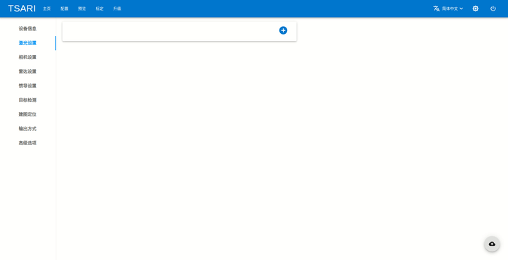
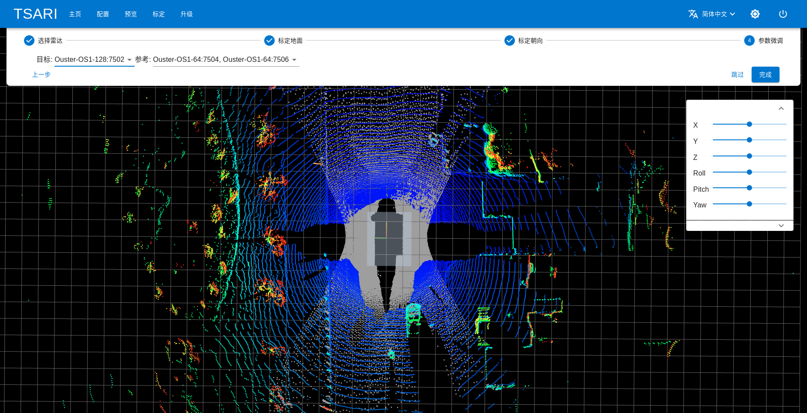
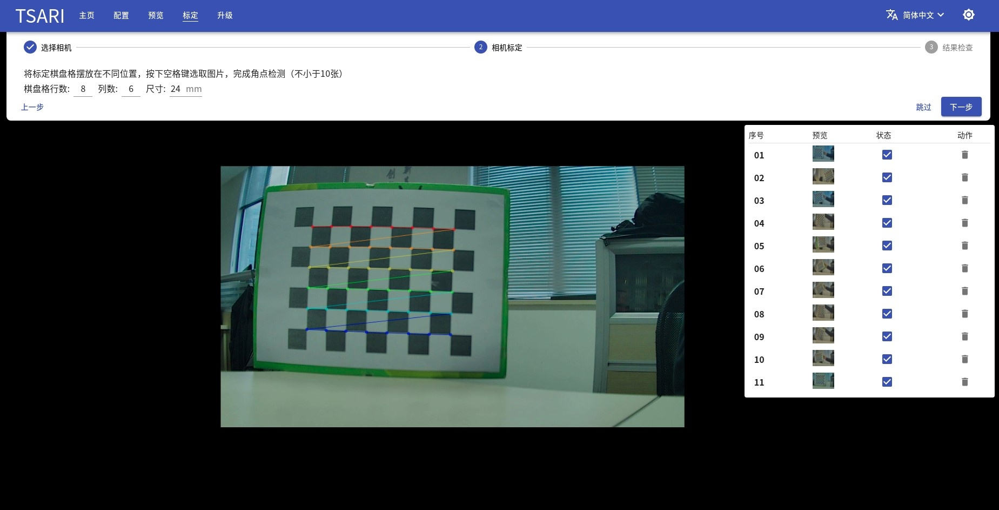
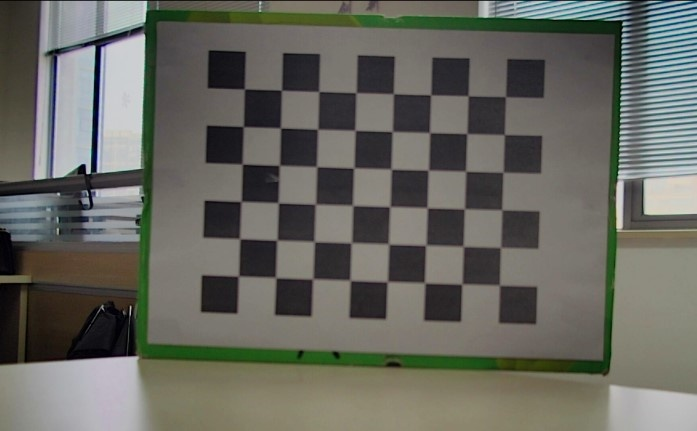
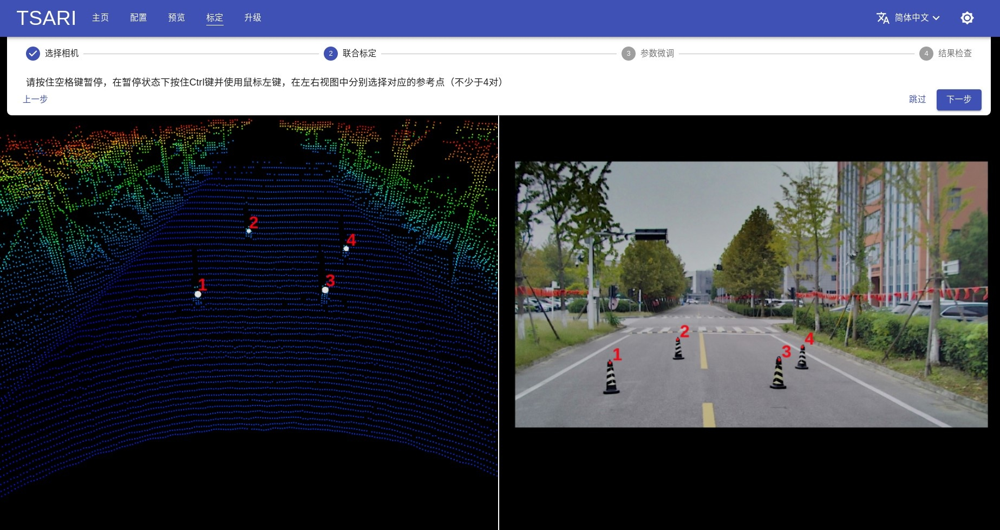
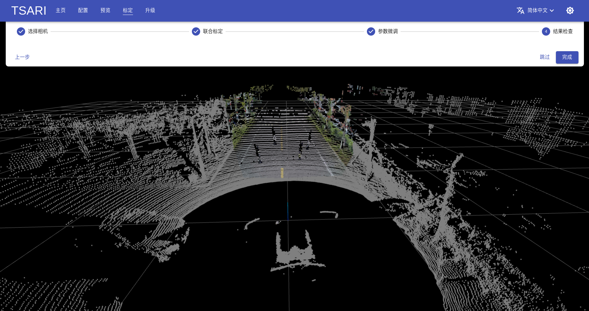
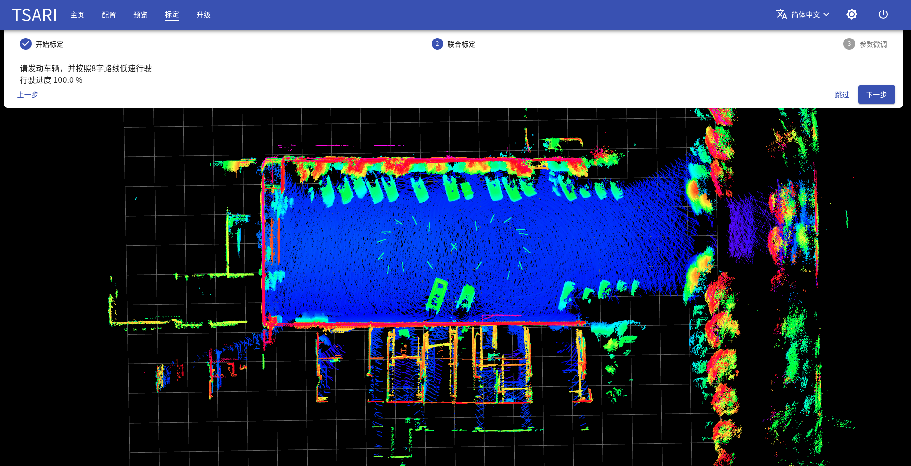
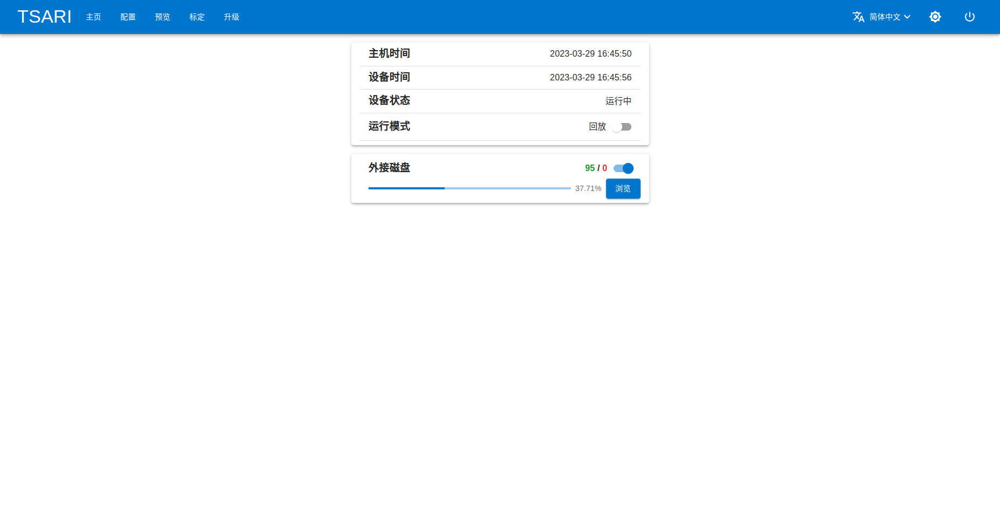

# Feature Preview

1. [Sensor Config](#sensor-config)
2. [Calibration](#calibration)
3. [Data Recoder/Player](#data-recoder)
4. [Object Detection](#detection)
5. [SLAM](#slam)

# Sensor Config

LSD can support various sensors including LiDAR, Camera, Radar, INS/IMU etc.

|  Type   | Sensor                                                |
|---------|:------------------------------------------------------|
| LiDAR   | Ouster 32/64/128, RoboSense 16/32/80, VLP-16, LS-C-16 |
| Camera  | GMSL, RTSP, UVC                                       |
| Radar   | ARS408                                                |
| INS/IMU | CGI-610                                               |

# Calibration

LSD contains a calibration toolbox for calibration of various sensors conveniently.

## LiDAR Calibration

LiDAR calibration aims to calculate the extrinsic transform between LiDAR coordinate system and vehichle reference coordinate system.

LSD use a semi-automatic method for LiDAR calibration. The method includes three steps: ground plane calibration, orientation calibration and refinement.

### Ground Plane Calibration

At this step, we can calculate the pitch, roll and z parameters to transform the pointcloud to z=0 ground coordinate system.

1. draw the polygon that the points are fallback to the area of the ground.
2. extract the points within the polygon (check the intersect number).
3. detect the plane coefficients [a, b, c, d] by RANSAC fitting.
4. calculate the rotation matrix and translation between [a, b, c, d] and [0, 0, 1, 0].

### Orientation Calibration

At this step, we calculate the yaw, x and y parameters to align the reference coordinate.

1. select the specified points which the locations of points are already known.
2. format the Ax=b and use the least square method to solve it.

### Refinement

We can select a LiDAR as the baseline and refine the extrinsic parameters to make better alignment.

## Camera Calibration

Camera calibration aims to calculate the intrinsic parameters [cx, cy, fx, fy] and the distortion coefficient [k1, k2, p1, p2].

The calibration algorithm implemented in LSD is based on OpenCV camera calibration toolbox.

### Chessboard Detection

### Calibration Result

## LiDAR-Camera Calibration

LiDAR-Camera Calibration aims to calculate the extrinsic transform between LiDAR coordinate system and Camera coordinate system.

LSD use a semi-automatic method which needs to manually pick the cooresponding points in LiDAR pointcloud and image, then the PNP algorithm is used for solve the 3D-2D transformation problem.

## LiDAR-INS/IMU Calibration

LiDAR-INS/IMU Calibration aims to calulate the extrinsic transform between LiDAR coordinate system and INS/IMU coordinate system.

### LiDAR-INS Calibration

We assume the INS can output accurate location and rotation information, then the calibration problem can be fomulated to minimize a cost function.

The cost function is that sums the distance between points of serveral frames and the extrinsic parameter [x, y, z, r, p, y] is the variable and the libnlopt is used for solving the optimization problem.

### LiDAR-IMU Calibration

We only calibrate the rotation part qli between LiDAR and IMU.

- The transformation Ql of frame-by-frame of LiDAR is computed by GICP registration.
- The rotation pose Qi in IMU coordinate system can be calculated by integrating the imu measurements.

We can formulate the Ql * qli = Qi * qli, it is a homogeneous linear equation, so we can solve it by SVD.

# Data Recoder

LSD can support software time syncing for sensors and realtime data recording.

The data is recorded as a python dictionary and serialized to serveral pickle files.

Here is the example data is listed as below:

|  Data Name            | Type                 | Description                                                               |
|-----------------------|:---------------------|:--------------------------------------------------------------------------|
| frame_start_timestamp | uint64_t             | the start time of frame (us)                                              |
| lidar_valid           | boolean              | indicate the LiDAR data is valid                                          |
| points                | Dict: name - > numpy | pointcloud of LiDAR, key is the sensor name, value is a n x 4 numpy array |
| image_valid           | boolean              | indicate the camera data is valid                                         |
| image                 | Dict: name - > bytes | JPEG image data, key is the sensor name, value is compressed jpeg data    |
| ins_valid             | boolean              | indicate the INS/IMU data is valid                                        |
| ins_data              | Dict                 | store the data of latitude,longitude,altitude and gyro, accelerator, etc  |

## Demonstration

# Data Player

The data player in LSD is used to playback the recorded data, we can easily select the data directory and play from the Web UI

The basic operations like start, pause, resume and seek is supported

## Demonstration

# Detection

Object detection is a sub-system in LSD. There are three modules:
1. CNN based 3D BoundingBox detection of LiDAR
2. Multi object tracking
3. Motion model based object trajectory prediction

Object category like "vechile", "pedestrian", "cyclist" and "traffic cone" can be detected.

Here is the demo video.

# SLAM

Simultaneous localization and mapping is a sub-module of LSD.

LSD can be used to build high precision pointcloud map or do localization by fusion various sensors.

We divide the SLAM into two parts:

1. pointcloud mapping.
2. realtime relocalization/localization.

## PointCloud Mapping

The odometry estimation is based on GICP, LOAM algorithm and the pose graph is used to add GPS, loop constraints. We have tested with Ouster and RoboSense LiDARs in indoor and outdoor enviroments.

## Realtime relocalization/localization

The pointcloud map which built by mapping module can be used to do realtime relocalization/locatization.

The realtime locatization is based on NDT/GICP matching and the UKF is used to esitmate the pose.

