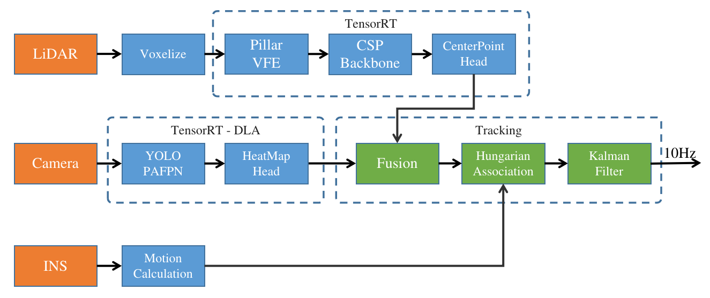
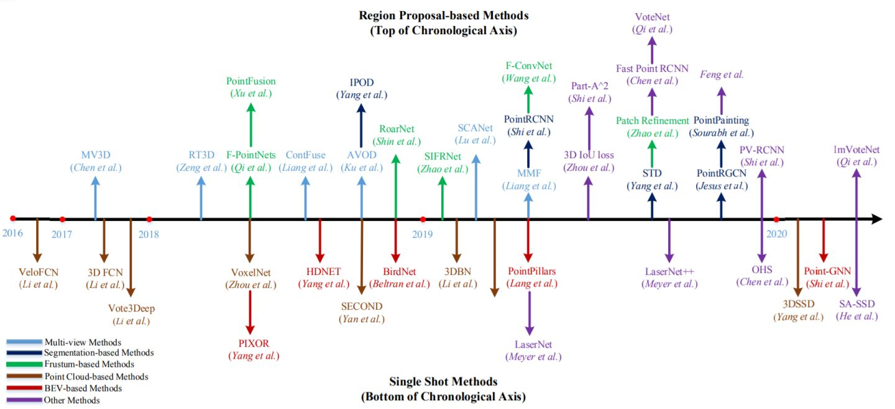
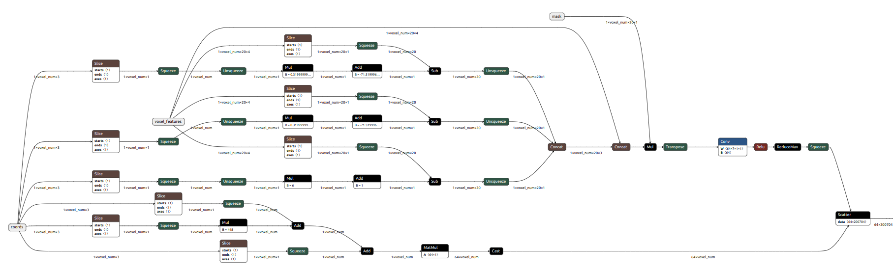
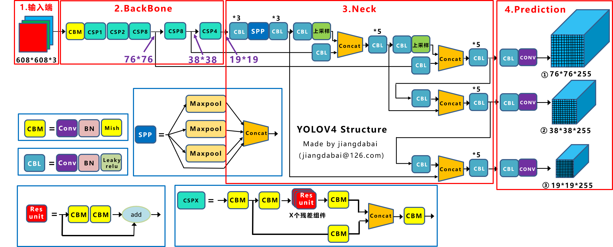
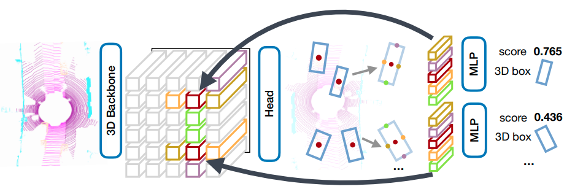
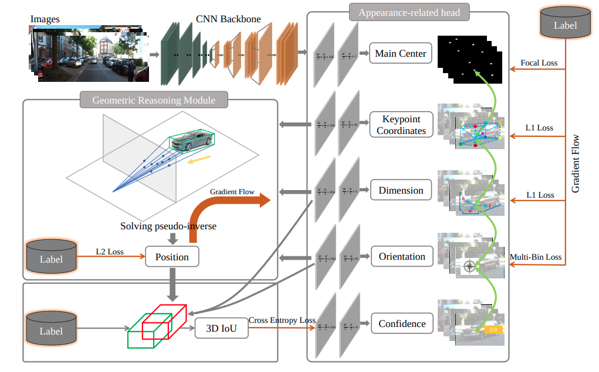
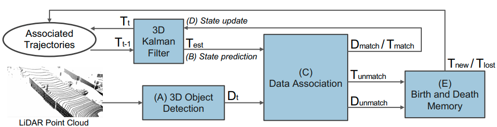

# 3D目标检测

目标检测是自动驾驶/机器人环境感知系统中的一项基本任务，常见的目标检测算法可以分为两大类:
1. 基于图像的2D目标检测，输出图像坐标下的2D Box(x, y, l, w, c)，由于缺少目标的深度和朝向信息，难以用于机器人的规划和控制
2. 基于激光点云/相机的3D目标检测算法，输出以自车为原点坐标系下的3D Box (x, y, z, l, w, h, yaw, c)

LSD采用了改进的PointPillar和RTM3D算法，能够实现激光点云/单目相机的3D目标检测功能，在推理时转换成TensorRT FP16引擎运算，支持在x86 PC, Xavier NX, Xavier AGX和Orin平台上实时运行。相关实现代码位于sensor_inference目录。整体框架如下图所示:

# 点云3D目标检测

自2017年以来，点云3D目标检测涌现了很多经典算法，下图是按时间排序的检测算法:

跟图像2D目标检测算法类似，3D目标检测算法也可以分类为"单阶段"/"多阶段"、"Anchor base"/"Anchor free"、"Point base"/"Voxel base"等，其中APTIV提出的PointPillar由于其部署简单、计算效率和检测精度较高等优势，在实际的工程项目中应用广泛。

LSD基于原版PointPillar网络结构，对模型结构进行了优化:
- 在PillarVFE结构中删除了xyz的均值特征，保留了每个点的x,y,z,i及其voxel中心offset特征
- SSD backbone替换为基于CSPNet结构的backbone
- Anchor based检测头替换为CenterPoint网络的Anchor free检测头，并添加了IOU aware分支

## Voxelize

由于PointPillar网络的输入是Voxel(z轴方向只有1维，也叫作Pillar)，因此我们需要将原始点云[n, 4]体素化，其中n为点云个数和每个点的特征(x,y,z,intensity)。在LSD中，我们设置每个voxel的尺寸为[0.32, 0.32, 6]，单位为米，且每个voxel最多包含32个点，通过将点云投影到其对应的voxel中，可以得到:
- voxel特征，维度为[m, 32, 4]
- voxel坐标，维度为[m, 3]
- 每个voxel中点的个数，维度为[1, m]
- 每个voxel中点的mask，维度为[m, 32]

其中m为计算得到的voxel个数，上述4个变量作为后续神经网络的输入。

## Pillar VFE

Pillar VFE结构主要是对每个voxel中的点特征进行提取(由7维特征[x, y, z, i, xp, yp, zp]经过卷积得到64维)，并根据每个voxel的坐标投影到2D BEV网格得到[64，448，448]大小的特征(最大检测范围设置为71.68m)

## CSP Backbone

PointPillar原版采用的是SSD backbone，其结构较为简单、参数量小，在实际测试时发现当训练数据量增大后检测精度提升幅度较小，因此，我们参考了YOLO V4的backbone，其主要由CSP Net基础block组成，通过权衡检测精度和实时性，我们构建了4个下采样block和3个上采样block网络来对多尺度特征进行提取和融合，最后输出[48，224，224]和[192, 56, 56]两种尺度特征，详细的网络结构可以参见[CSPDarknet53Small.py](https://github.com/w111liang222/lidar-slam-detection/blob/main/sensor_inference/model/CSPDarknet53Small.py)。

## CenterPoint Head

LSD采用了多检测头结构，针对backbone输出的2个尺度特征，分别连接了两个CenterPoint检测头，相比于原版的Anchor based检测头，Anchor free在检测小目标时精度更高。另外，我们还参考了CIA-SSD网络模型，添加了IOU-Aware预测分支，进一步提高了检测精度。

# 单目3D目标检测

大多数激光雷达由于发射结构的原因，其点云具有近处密集，远处稀疏的特点，从而导致激光雷达在检测距离较远的目标时精度较低，而图像在距离较远时相比激光雷达更容易分辨目标，因此LSD采用了单目3D目标检测算法来提高远距离目标的检测精度以适应高速场景。

## RTM3D

RTM3D (Real-time Monocular 3D Detection from Object Keypoints for Autonomous Driving)是一个单目3D目标检测网络，其主要思想是通过网络预测目标框的8个顶点、质心、深度和朝向信息，并求解伪逆方程得到目标的3DBox。

在LSD中，我们对RTM3D的结构做了部分微调：
- 由ImageNet预训练的Resnet18 backbone替换为Darknet53
- 检测头增加heatmap输出，用于后续的目标融合

# 模型训练和推理

模型训练基于OpenPCDet框架实现，将公开的WOD、Nuscences、Lyft、Panda Set和DeepRoute等数据集进行了合并，并且将不同数据集的各个类别重新分类为“车辆”、“行人”、“骑行车”和“三角锥”4种类别。服务器采用4张2080Ti显卡训练50个epoch。

在模型推理阶段，我们将Pytorch模型导出成ONNX文件，并分别在Jetpack5.0.2 Xavier NX、 AGX、 Orin平台上生成了TensorRT FP16引擎进行推理（单目3D模型则运行在DLA上），在Xavier NX平台上运行耗时约80ms，能够满足实时性要求。

# 后融合

数据融合用于融合多传感器数据来提高检测精度，按实施阶段可以分为前融合和后融合，前融合通常处理传感器的原始数据，而后融合则处理各传感器分别计算后的目标数据。在LSD中，我们采用了后融合的方式，将激光点云输出的3D目标列表和单目视觉输出的3D目标列表融合为一个目标列表并输出给目标跟踪模块。我们实现了一个相对简单的基于规则的融合算法：
1. 将激光点云输出的3DBox根据激光-相机外参投影到图像坐标系下得到2DBox，计算与视觉目标的2D IOU
2. 利用匈牙利算法进行匹配，得到matched、unmatch_camera和unmatch_lidar三个目标列表
3. 针对matched列表，我们将激光点云输出的3DBox直接作为输出，对于confidence属性求激光和相机目标的均值加上0.2 * IOU
4. 针对unmatch_lidar列表，利用RTM3D输出的heat map对confidence属性求均值
5. 合并matched, unmatch_camera和unmatch_lidar得到最终的目标列表输出

# 多目标跟踪

3D目标检测和融合算法处理的是传感器的单帧数据，单帧检测难以获取目标的运动信息，并且容易出现检测结果跳变等问题，在时间序列上对目标进行跟踪，可以估算出目标的运动速度、角速度，同时能够输出较为稳定的目标列表给下游规划控制模块。目标跟踪算法通常可以分解成两个步骤：
1. 根据相似度对相邻帧目标进行关联匹配
2. 对目标进行观测并估计最优状态

LSD采用了传统的基于规则的目标匹配和状态估计算法，算法基于AB3DMOT(A Baseline for 3D Multi-Object Tracking and New Evaluation Metrics)实现，并在其基础上进行了优化，能够输出更稳定的目标列表。

## 目标匹配

匈牙利算法是一种求解二分图最小权值匹配问题的方法

### 相似度计算

针对不同类别，我们采用了不同的方法来计算前后帧目标相似度(权值):
- 针对车辆目标，计算两两之间的BEV IOU
- 针对行人、骑行者和三角锥，由于目标较小，前后帧的IOU大部分为0，因此计算两两中心点的欧式距离

### 最优匹配求解

得到相似度矩阵后，我们利用scipy.optimize.linear_sum_assignment函数求解得到三个输出:
- matched: 前后帧匹配上的目标
- unmatch_old: 在前一帧跟踪列表中未匹配上的目标
- unmatch_new: 当前帧检测输出但未匹配上的目标

## 卡尔曼滤波跟踪

卡尔曼滤波是一种状态估计算法，在LSD中，我们使用卡尔曼滤波算法对目标进行建模和状态估计:
1. 针对unmatch_new目标，作为当前帧新出现的目标，添加进跟踪列表
2. 针对unmatch_old目标，表示当前帧该目标未检测到，通过运动学模型对其进行预测
3. 针对matched目标，将当前帧作为观测值，利用卡尔曼滤波器对其状态更新