# 高精度点云地图构建

点云地图构建是通过激光雷达扫描周围环境，SLAM算法估计当前位置和姿态，将自身坐标系下的点云转换到世界坐标系，从而构建点云地图。LSD能够融合IMU/GPS等多传感器信息，配合多种前端里程计、后端优化算法、地图编辑，实现高精度点云地图构建功能。相关实现代码位于**slam/mapping**目录。

LSD中的SLAM系统架构如下所示:

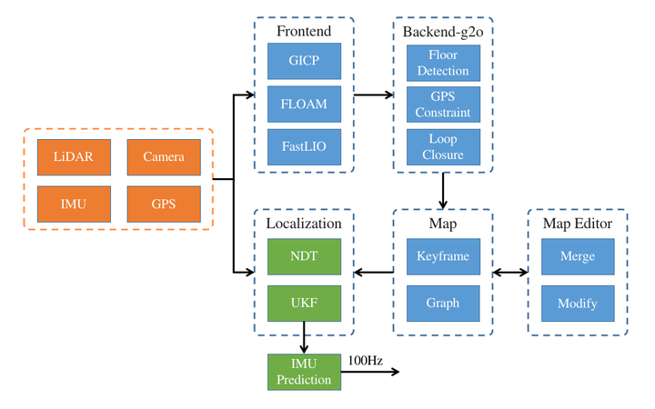

## 前端里程计 - GICP

GICP是一种点云配准算法，输入点云Q1和Q2，能够计算出Q1- Q2的变换关系。LSD基于开源的fast_gicp，将激光雷达接收到的最新点云与局部地图点云进行配准，从而得到自身在全局坐标系下的位姿。

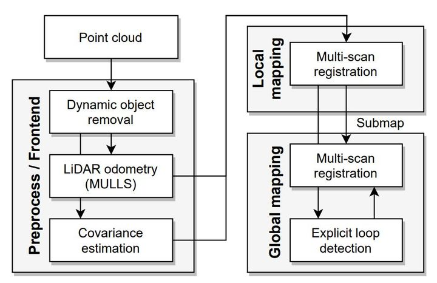

具体算法步骤如下：
1. （可选）求取相邻两帧点云间的IMU数据，积分后用于对点云做运动畸变校准
2. 利用pcl::VoxelGrid对当前帧点云下采样
3. 将下采样后的点云与当前局部地图做GICP配准，得到当前位姿
4. 将当前点云变换到全局坐标系，并添加到局部地图中（最多保留最新时刻的10W个点）

- 优点：适配大部分激光雷达点云（旋转式、固态等），建图精度较高。
- 缺点：当处理线数较高的激光雷达时，计算耗时较高。

## 前端里程计 - FLOAM

LOAM: LIDAR odometry and mapping in real-time是激光SLAM中的经典算法，主要通过提取点云中的edge和surf特征来进行匹配定位。FLOAM是在LOAM算法基础上优化了运算效率。

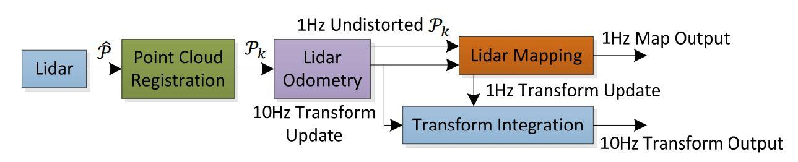

具体算法步骤如下：
1. （可选）求取相邻两帧点云间的IMU数据，积分后用于对点云做运动畸变校准
2. 将点云按照激光雷达线束ID进行分类，并提取edge和surf特征
3. 构建当前帧与地图之间的edge和surf特征的代价函数，并利用ceres求解得到当前位姿
4. 更新局部地图特征

- 优点：大部分场景下建图精度比GICP高
- 缺点：目前只适用于旋转式激光雷达建图，需要线束ID作为数据输入（LSD录制时会保存该信息）

## 前端里程计 - FastLIO

FastLIO是香港大学MARS实验室提出的激光-IMU紧耦合里程计算法。其创新点在于利用ESIKF来替代求解优化问题，使用iKDTree增量更新局部地图，从而提高算法实时性。

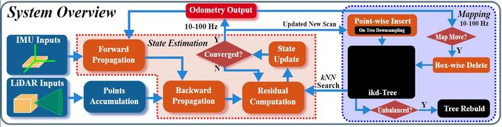

具体算法步骤如下：
1. 求取相邻两帧点云间的IMU数据，积分后用于对点云做运动畸变校准
2. IMU预积分
3. 对当前帧点云提取edge，surf特征（LSD中使用原始点云）
4. ESIKF迭代更新状态，求取最优估计的当前位姿
5. 更新局部地图特征

- 优点：建图精度高，计算效率高
- 缺点：依赖高频IMU数据，需要提前进行激光雷达-IMU外参标定

## 后端优化 -G2O

g2o是一个由C++语言实现的开源的图优化框架，可以用于求解非线性优化方程。LSD基于hdl_graph_slam中的后端优化框架，将其抽离并作为一个独立的后端优化模块，使之能够与多种前端里程计相组合，从而完成关键帧选取与管理、位姿图构建、回环检测等功能。

### 地面约束

地面约束是一种先验约束，当移动机器人位于一个包含平坦地面的环境中时，利用地面提取算法，提取点云中的地平面信息，将其与先验的地平面方程建立约束，并添加到位姿图中求解优化，能够缓解Z轴漂移问题。地面提取算法具体步骤如下：

1. 根据设置的高度参数，提取满足hmin < h < hmax 条件的点云
2. 计算每个点的法向量，滤除与x-y平面夹角大于20度的点
3. 使用RANSAC拟合平面，计算地平面参数[a, b, c, d]
4. 添加g2o::EdgeSE3Plane边到位姿图进行优化求解

### 回环约束

由于前端里程计递推时存在一定的误差，当移动机器人经过一圈并行驶到起始点时，由于累计误差，导致位姿存在漂移。通过回环检测并添加回环约束，可以减少累计误差，从而保证构建的地图具备较好的一致性。LSD实现的回环检测算法具体步骤如下：

1. 查找距离当前位置周围一定范围内的关键帧放入列表lk
2. 对列表 lK 每个关键帧，与当前帧进行GICP匹配，并计算匹配的得分（fitness score）
3. 找出最优的fitness score，并判断是否满足阈值条件
4. 当满足阈值条件时，将GICP计算的相对变换来构建g2o::EdgeSE3边添加到位姿图进行优化求解

### GPS约束

GPS是一种全局定位传感器，由GPS卫星来进行定位，因此没有累计误差，其缺点是使用场景是室外空旷场景。因此在室外场景下，借助GPS能够实现大范围建图。在LSD中，我们将GPS分为3类：

1. 2D GPS，只能输出latitude和longitude数据，使用g2o::EdgeSE3PriorXY约束表示
2. 3D GPS，能够输出latitude、longitude和altitude数据，使用g2o::EdgeSE3PriorXYZ约束表示
3. 6D GPS（比如组合导航），能够输出latitude、longitude和altitude加上pitch、roll和yaw姿态，使用g2o::EdgeSE3PriorXYZ+g2o::EdgeSE3PriorQuat约束表示。

不同GPS的定位精度也各不相同，因此我们使用GPS约束的information matrix来表示。

## 地图编辑

根据上述算法完成地图构建后，可能由于某些原因（退化场景、Z轴漂移等），导致地图存在重影或者由于动态障碍物导致的鬼影等问题，我们需要对地图进行后处理。为此，我们开发了一个基于Web的地图编辑工具（内置在LSD中），可以对建好的点云地图进行人工编辑。地图编辑页面进入方式：在浏览器中输入URL http://localhost/editor （若本机80端口占用，则访问http://localhost:1234/editor 即可）

### 打开地图

在Web 编辑页面中，我们可以任意选取想要进行编辑的地图，打开并显示。

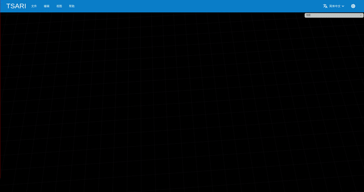

### 合并地图

当我们在不同区域、不同时间构建了多幅地图时，我们想要将其合并为一个完整地图，借助LSD的点云编辑工具可以轻松完成地图合并。

### 手动回环

回环检测是消除累计误差的一种有效途径，但是由于算法的局限性，有些时候无法自动完成回环检测，需要手动添加回环约束，我们可以在地图编辑工具中进行：

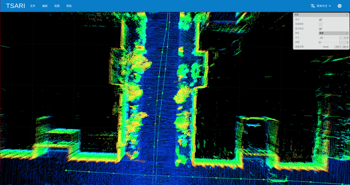

### 点云框选/编辑

在完成地图构建任务时，我们希望场景中没有运动物体来构建静态的地图，然而大部分时候无法满足这样的条件，在对动态场景构建地图时，通常会在地图中存在运动物体产生的点云，在这种情况下，我们借助地图编辑工具，可以完成对点云进行选取/删除操作：

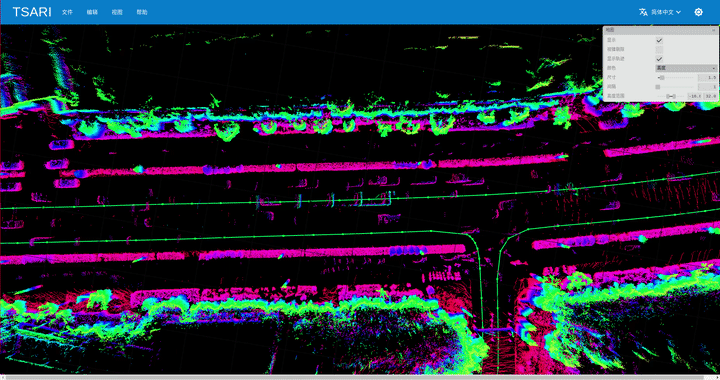

以上介绍的只是几个基本功能，还有更多功能将不在本文中一一说明了。

## [点云着色](colouration.md)

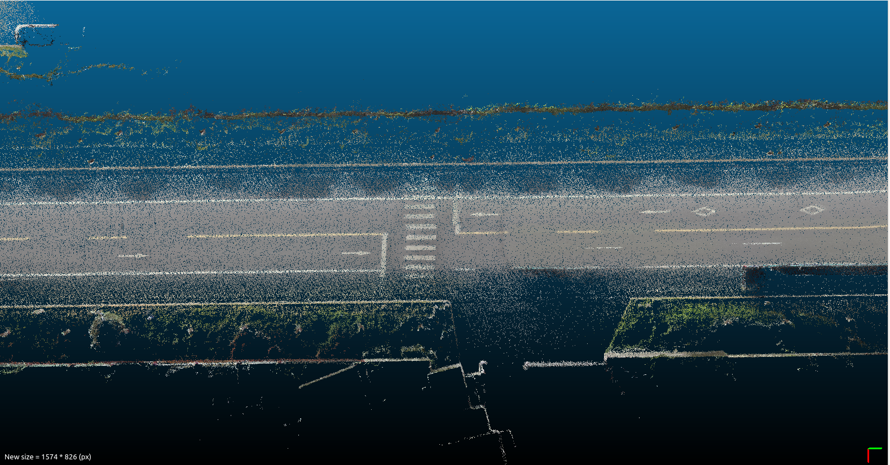

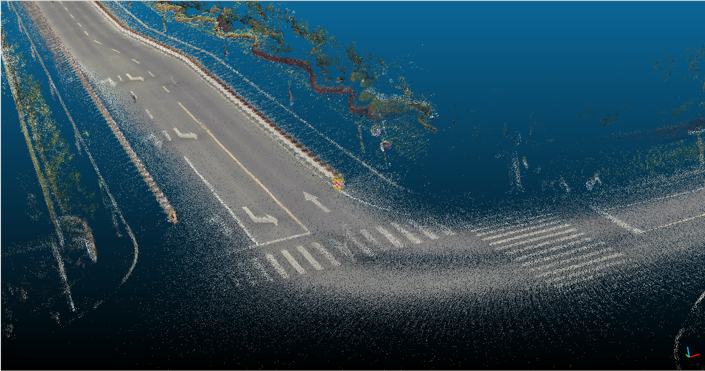

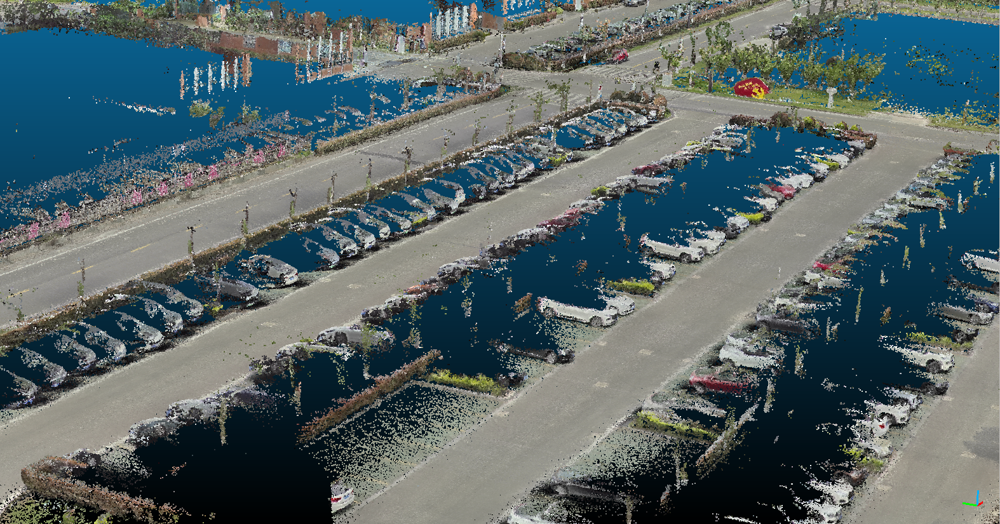

## 使用案例

在这里我们针对某地下停车场（测试数据集可以在这里下载 [Google Drive](https://drive.google.com/file/d/149LtZyBVk2m5RRM6xxSEmmYiiGTlaOCu/view?usp=sharing) | [百度网盘(密码1prw)](https://pan.baidu.com/s/1zQY7b_Doe_EAqWX9cXq7ww) ），来演示一下LSD的地图构建功能。操作步骤如下：

1. 首先启动LSD后，打开Web配置页面，将“设备信息”->"工作模式”配置成“建图定位”模式，点击完成设置
2. 然后进入左侧的"建图定位"进行详细设置，工作模式配置成“建图模式”，前端里程计选用FastLIO，并在传感器配置中使用“速腾16线激光雷达”+“相机0”+“IMU”
3. 地图参数的距离步长和角度步长分别设置成1m和20°， 点云精度为0.15m，同时打开地面约束和回环检测功能

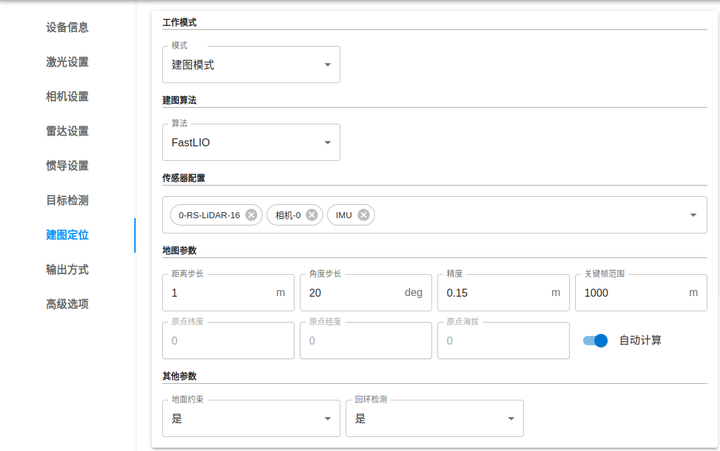

配置完成后，我们进入“预览”页面，我们可以看到地图的构建过程。

# 点云实时定位/重定位

通过前面的介绍，我们已经可以构建一份高精度的点云地图，定位算法的目的就是找到当前移动机器人在地图中的准确位置。相比于地图构建，定位算法更注重实时性，需要能够在固定的时间周期内完成定位，并输出给下游规控模块。在LSD中，我们将定位模块划分为2个功能子模块：重定位模块和实时定位模块，相关实现代码位于**slam/localization**目录。

## 重定位算法

当移动机器人刚上电开机时，虽然我们有了一份周围环境的全局地图，但并不清楚初始的位置在哪里，我们首先需要确定起始位置才能完成后续的连续定位任务。因此，重定位算法的目的就是根据当前激光雷达扫描的点云、视觉传感器返回的图像等传感器信息，来确定移动机器人在地图中的起始位置。

针对重定位问题，首先我们可以想到的方法就是遍历地图中的每一个位置，找到相似度最高的位置作为初始位置，然而当移动机器人处于大范围场景中时，遍历地图会导致计算时间太长，无法在一个可接受的时间内完成运算。在LSD中，我们开发了基于点云的ScanContext和图像的ORB BoW描述子相结合的算法来完成这项任务。

### ScanContext算法

ScanContext: Global LiDAR descriptor for place recognition and long-term localization 是一种点云描述子算法，类似的描述子有FPH/FPFH等，ScanContext是将点云按照角度和距离划分多个扇形区域并表示成一个N x M二维数组，每个扇形区域的值由落入该区域内的点的最大高度表示。SC描述子的优点在于计算速度快，具有旋转不变性，适用于轮式移动机器人场景。

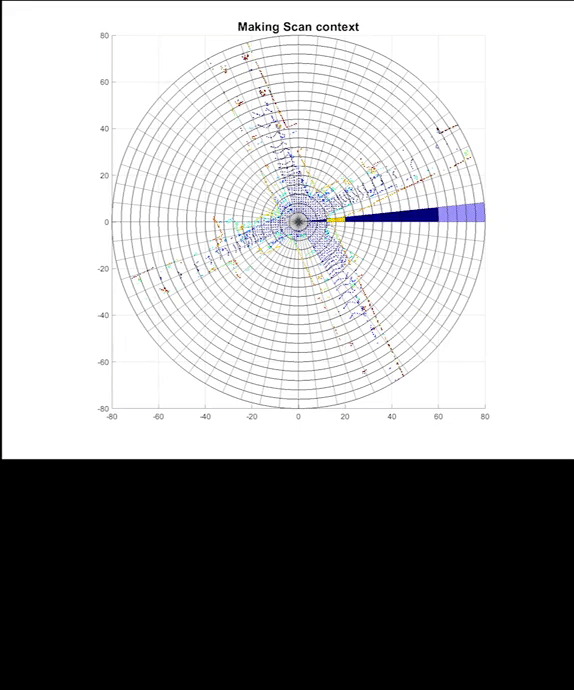

基于ScanContext的重定位算法流程：
1. 读取离线地图，对地图中每个关键帧提取SC描述子，并构建KDTree方便快速查找
2. 对当前获取的激光点云计算SC描述子，并在KDTree中查找出最相似的10个关键帧
3. 计算当前点云与这10个地图关键帧的SC相似度得分
4. 将最高得分的关键帧与当前点云进行GICP配准，满足fitness score阈值时则认为重定位成功，否则回到步骤二

### ORB Bag of Words算法

ORB是图像领域中的一种特征描述子，将多个ORB特征聚类可以组合为一个"Word"，对一副图像提取ORB特征并进行聚类，最终我们可以将一个图像描述成多个"Word"的组合，相似的图像会具有较多的相同的"Word"，根据这个特性，我们可以设计以下重定位算法：

1. 读取离线地图（地图的每个点云关键帧有对应的图像数据），对每个图像关键帧提取ORB特征和BoW（bag of Words）
2. 对当前获取的图像计算ORB和BoW
3. 遍历当前图像的Words，找出所有具有相同Word的关键帧并计算与其BoW的相似度得分
4. 将最高得分的关键帧图像所对应的点云与当前点云进行GICP配准，满足fitness score阈值时则认为重定位成功，否则回到步骤二

基于ORB BoW重定位算法的第四步需要依赖点云做精匹配(是由于只根据两幅图像计算相对变换较为困难)

### 组合重定位

LSD采用了ScanContext和ORB BoW相结合的方法，目前实现的逻辑比较简单: 在两个线程中分别进行SC重定位和ORB BoW重定位，当其中一个线程重定位成功即可

### 交互式重定位

由于重定位算法具有一定的局限性，例如在一些具有重复纹理的场景(比如地下停车场，一眼望去都是相似的车位)，导致上述算法可能无法正常工作。为此，我们开发了一种半自动化的交互式重定位功能，由用户提供大概的初始位置来完成。

通过点击"预览页面"右下角的按钮开启交互，用户拖动鼠标到移动机器人所在的大致区域，后端算法将当前点云与地图自动匹配并完成重定位。

## 实时定位算法

实时定位是指在移动机器人初始位置确定后，实时地对位姿进行跟踪(通过与局部地图进行匹配)，LSD对移动机器人建立了运动学模型和观测模型，利用UKF滤波器来估计最优的位姿。

### 状态预测(运动学模型)

我们定义了一个23维的状态量，表示为 [p, v, q, ba, bg, w, qi]，其含义是[位置，速度，姿态，加速度偏置，角速度偏置，角速度，IMU外参旋转量]。状态方程（未包含噪声项）如下： 

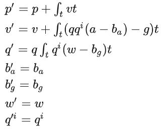

上述公式中输入的控制量a和w分别是IMU观测得到加速度和角速度，g为重力向量，基于上述运动学方程可以根据当前状态预测出下一时刻状态。

### 地图匹配(观测)

在卡尔曼滤波体系中，状态观测是其中的一个重要步骤。在这里我们采用当前帧点云与局部地图匹配来获得状态观测值

- 创建一个地图更新线程，根据当前位置找出周围30m内的关键帧点云作为局部地图
- 将当前位姿作为匹配初始化值，利用NDT匹配当前点云和局部地图点云，得到地图匹配观测值

### 融合激光里程计 & GPS

在LSD中，我们还融合了FastLIO激光里程计和GPS信息来提高定位精度, 根据地图匹配、里程计和GPS的协方差计算调和平均，得到最后的观测状态。

### 状态更新

利用上述得到的观测值更新UKF滤波器状态。

### 测试 & 评估

为了测试算法的定位精度，我们将组合导航的输出作为ground truth，来计算定位误差。我们选取了某个室外场景进行测试，传感器配置如下:

|  传感器   | 型号            |                                       |
|----------|:----------------|---------------------------------------|
| 激光雷达   | Ouster 128线   | 10Hz mode                             |
| 组合导航  | 华测CGI-610     | 测试时不作为定位算法输入，保证固定解状态  |
| IMU       | 组合导航内置IMU |                                       |

利用上述传感器提前构建点云地图:

在该点云地图上进行定位测试，测试结果如下表所示:

| 最大x轴位置误差（m）| RMSE x轴位置误差（m）| 最大Y轴位置误差（m）| RMSE y轴位置误差（m）| 最大Heading误差（deg）|RMSE Heading误差（deg）|
|-------------------|---------------------|--------------------|--------------------|----------------------|-----------------|
| 0.59              | 0.03                | 0.32               | 0.02               | 2.74                 |0.81               |

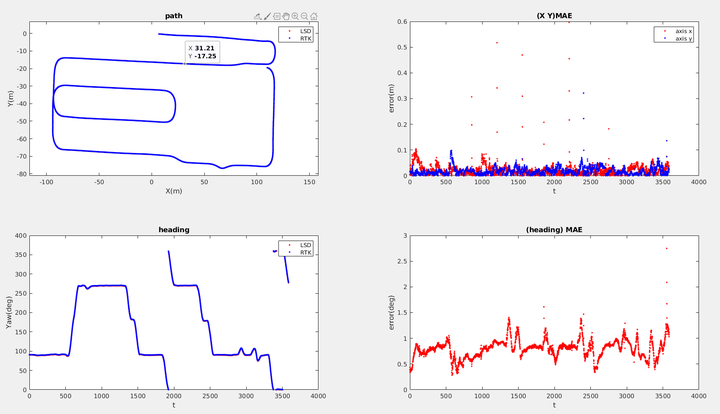

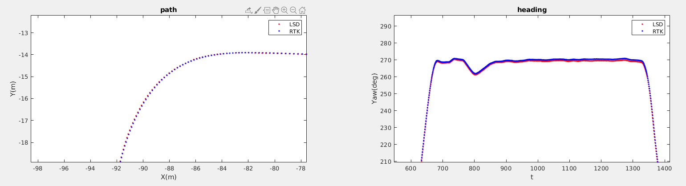